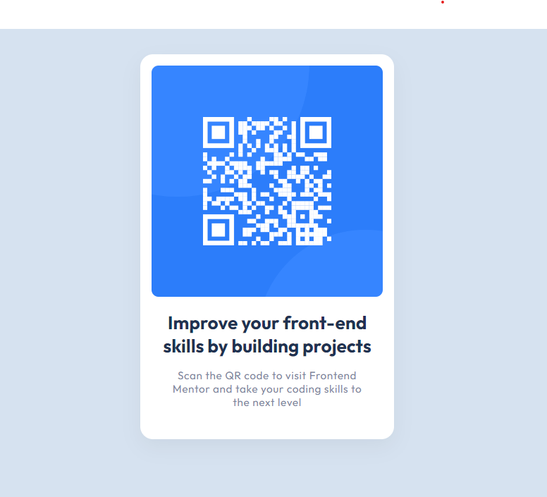

# Frontend Mentor - QR code component solution

This is a solution to the [QR code component challenge on Frontend Mentor](https://www.frontendmentor.io/challenges/qr-code-component-iux_sIO_H). Frontend Mentor challenges help you improve your coding skills by building realistic projects.

## Table of contents

- [Overview](#overview)
  - [Screenshot](#screenshot)
  - [Links](#links)
- [My process](#my-process)
  - [Built with](#built-with)
  - [What I learned](#what-i-learned)
  - [Useful resources](#useful-resources)
- [Author](#author)

## Overview

### Screenshot

### Links

 - [Solution](https://your-solution-url.com)
 - [live Demo](https://hazemhussein14.github.io/Qr-code-component/)

## My process

### Built with

- Semantic HTML5 markup
- CSS custom properties

### What I learned

I learned more about HTML semantic elememts

### Useful resources

- [MDN](https://developer.mozilla.org/en-US/docs/Web/HTML/Element/main) - This helped me for choosing the right semantic element to be a container. I really liked this pattern and will use it going forward.
- [htmlreference.io](https://htmlreference.io/semantic/) - This is an amazing article which helped me finally understand the usage of the semantic elements. I'd recommend it to anyone still learning this concept.

## Author

- Frontend Mentor - [@HazemHussein14](https://www.frontendmentor.io/profile/HazemHussein14)

